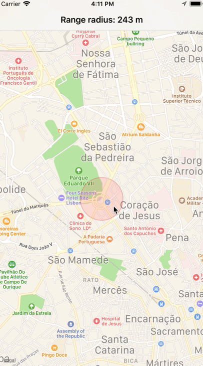

# RangeRadiusMKMapView

[](https://travis-ci.org/carlosmouracorreia/RangeRadiusMKMapView)
[](http://cocoapods.org/pods/RangeRadiusMKMapView)
[](http://cocoapods.org/pods/RangeRadiusMKMapView)
[](http://cocoapods.org/pods/RangeRadiusMKMapView)


This Pod allows for easy integration of a swipable CircleOverlay within a custom subclass of MKMapView.
The library is 100% written in Swift and inspired (partially re-written from) on [ResizableMKCircleOverlay](https://github.com/OrbJapan/ResizableMKCircleOverlay) (written in Objective-C)



## Example

To run the example project, clone the repo, and run `pod install` from the Example directory first.

## Simple Usage

**Important notice: RangeRadiusMKMapView conforms to MKMapViewDelegate by default; If you want to conform to it on your own, you need to read further below.**

Check the [ViewController example](Example/RangeRadiusMKMapView/ViewController.swift) for initialization details.

### Setting a radius with range (Resizable CircleOverlay)

```Swift

 //DEFAULT_COORDINATE is a CLLocationCoordinate2D instance
  self.mapView.setRadiusWithRange(centerCoordinate: DEFAULT_COORDINATE, startRadius: 200, minRadius: 100, maxRadius: 4000)
 
 //this value is active by default - if not, the user can't change the radius
 self.mapView.rangeIsActive = true
```

### Getting information about the radius

You need to conform to MKRadiusDelegate somewhere and pass the reference delegate upon initialization of the RangeRadiusMKMapView

```Swift 
	 self.mapView = RangeRadiusMKMapView(frame: .zero, delegate: self)
```

```Swift 
extension ViewController : MKRadiusDelegate {
    func onRadiusChange(_ radius: Double) {
    	//From the example app
       	self.setRangeTitle(radius)
   	}
 }

```


### Setting custom UI properties AND having your own MKMapViewDelegate

By design, it's better and more useful to have your own class to conform to MKMapViewDelegate (the RangeRadiusMKMapView conforms to it by default) to handle more interesting events other than the loner overlay render - this is what happens by default when you use this MKMapView subclass. To be able to customize your Overlay (Radius Range) you need to conform to MKMapViewDelegate and implement the `mapView(_ mapView: MKMapView, rendererFor overlay: MKOverlay)` function:


```Swift 
	 self.mapView.delegate = self
```

```Swift 
extension ViewController : MKMapViewDelegate {
    func mapView(_ mapView: MKMapView, rendererFor overlay: MKOverlay) -> MKOverlayRenderer {
       	let properties = RangeRadiusProperties(fillColor: UIColor.red, alpha: 0.5, border: 50, borderColor: UIColor.black)
       	return self.mapView.getRenderer(from: overlay, properties: properties)
   	}
}
```


## Installation

RangeRadiusMKMapView is available through [CocoaPods](http://cocoapods.org). To install
it, simply add the following line to your Podfile:

```ruby
pod 'RangeRadiusMKMapView'
```

## Author

carlosmouracorreia, pm.correia.carlos@gmail.com

## License

RangeRadiusMKMapView is available under the MIT license. See the LICENSE file for more info.
